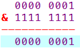
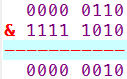

# 【志银】#define lowbit(x) ((x)&(-x))原理详解

# 分析下列语句
```c++
#define lowbit(x) ((x)&(-x))
```

　　可写成下列形式：

```c++
int Lowbit(x) {
  return x&(-x);
}
```

## 例1：x = 1

十进制转二进制**（设位数为８）**：

1 => 0000 0001

-1=> 1111 1111**(此处为1的补码)**

1&(-1)的二进制位运算为**(二个二进位都为1)**：



所以1&(-1)=1

## 例2：x = 6

十进制转二进制**（设位数为８）**：

6 => 0000 0110

-6=> 1111 1010**(此处为6的补码)**

6&(-6)的二进制位运算为**(二个二进位都为1**)：



所以6&(-6)=2

# 总结

求出2^p(其中p: x 的二进制表示数中， 右向左数第一个1的位置)，

如6的二进制表示为110，向左数第零个为0，第一个为1，则p=1，

故Lowbit(6) = 2^1 = 2。

**或直接理解为：二进制按位与运算，返回不大于x的2的最大次方因子**

> 开始于：2016-03-18、16:37:32    