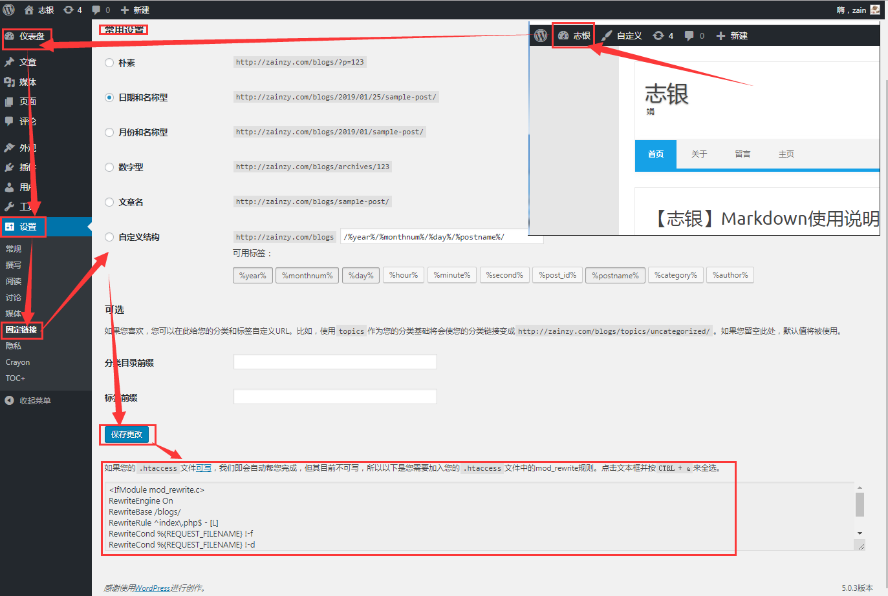
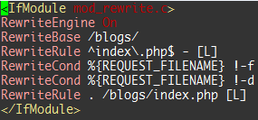
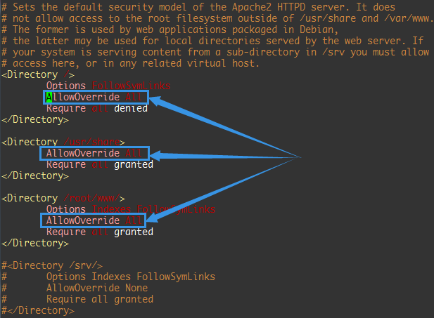
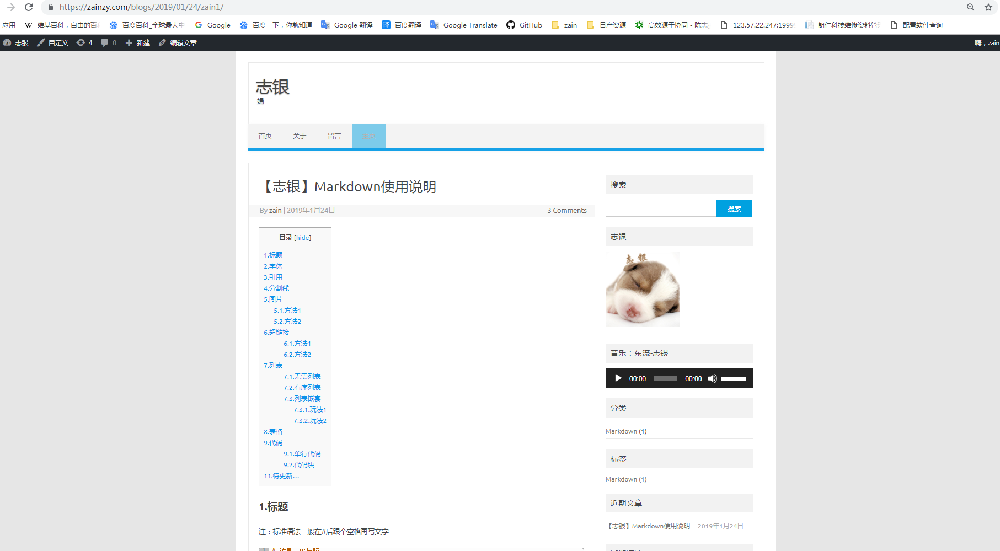

# 【志银】WordPress固定连接修改(解决页面404)

# 配置

**下列是我的配置，类似配置也适用**

系统：Ubuntu 18.04

服务：Apache 2.4.18

数据库：MySQL 5.7.24

后端：PHP 7.0.32

WordPress 5.0.3

# 1.固定链接设置

**【仪表盘】**>**【设置】**>**【固定连接】**> **[选择喜欢的配置]** > **【保存更改】**

PS：若下方提示`.htaccess`文件**不可写**，则进行后续操作，若无下方提示且修改后页面可正常访问，则不用进行后续操作



# 2.修改`WordPress`配置文件

进入WordPress根目录，向`.htaccess`文件中加入下列内容(实际**加入提示内容**，下列为演示)

```c++
vim .htaccess  //vim编辑
```

```markdown
<IfModule mod_rewrite.c>
RewriteEngine On
RewriteBase /blogs/
RewriteRule ^index\.php$ - [L]
RewriteCond %{REQUEST_FILENAME} !-f
RewriteCond %{REQUEST_FILENAME} !-d
RewriteRule . /blogs/index.php [L]
</IfModule>
```

```c++
:wq  //保存退出
```



# 3.修改Apache2配置文件

修改Apache2配置文件`apache2.conf`，将`AllowOverride None`改为`AllowOverride All`

```c++
vim /etc/apache2/apache2.conf  //vim编辑
```



# 4.重启Apache2服务

重启服务器搞定，祝贺！

```markdown
service apache2 restart
```

