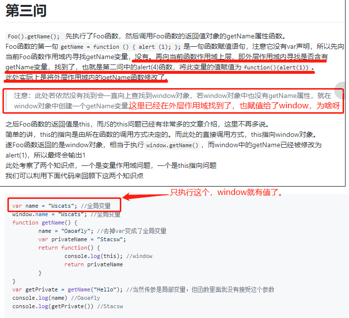
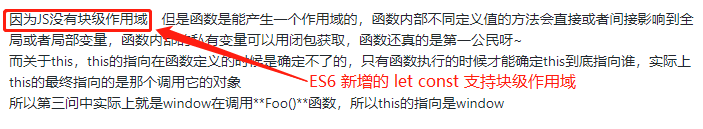

# 30361-腾讯文档 Alloyteam  Web 前端开发-(深圳)

## 1、腾讯文档-业务相关

- 当前面的团队主要负责哪些业务
- 大概有多少前端团队
- 用的技术栈是啥（可能不能公开）
- 主要用 ts 还是 js

## 2、个人项目相关

### 2.1、工作项目

### 2.1、github 项目

## 3、代码贡献相关

## 4、疑问

### 前端程序员经常忽视的一个JavaScript面试题

https://github.com/Wscats/articles/issues/85

问题1：

用 var 直接在控制台声明变量，变量会直接给到 window。用 let 不会有这种现象。为啥子呢。

问题2：

块级作用域描述更新。

## 5、闲聊

