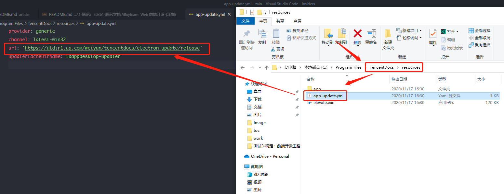
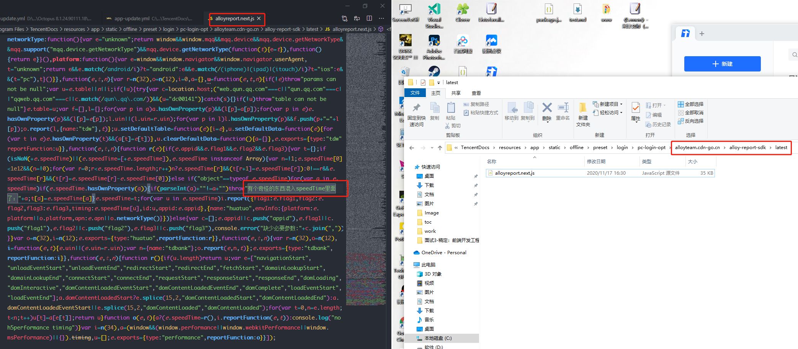
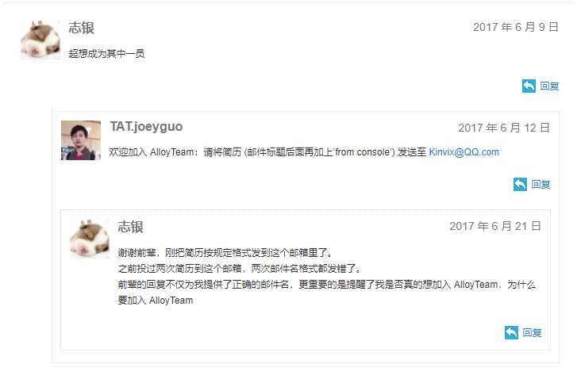

# 30361-腾讯文档 Alloyteam  Web 前端开发-(深圳)

# 知识点准备

- 深拷贝
- 闭包
- 作用域
- js 面向对象
- http
- 快速排序
- 深搜
- 广搜

# 主动聊的内容

## 1、腾讯文档-业务相关

### 1.1、前端团队和业务

腾讯文档大概有多少前端在弄，大概多少个前端团队，我们团队主要负责哪些业务？

### 1.2、技术栈

主要用 ts 还是 js，React 还是 Vue？

### 1.3、 electron

window 版的客户端是 electron 写的吗，看到安装目录的文件里有相关代吗？

如果是 electron，BrowerWindow 有个改变窗口默认背景颜色的参数，优化窗口拖动黑边问题，backgroundColor，可能已经用上了。

### 1.4、AlloyTeam 发现

发现有用 AlloyTeam 命名的文件夹，厉害了。

不知道这个文件夹，是不是我们团队负责的，哈哈。

### 1.5、腾讯文档，一个有点影响体验，比较重要的地方

现在用的是第三方的组件还是自己写的呀。

很多地方都用用到的“菜单(Menu)”组件。

结合 vscode 的菜单组件，还有 zain-ui 的菜单组件说明

### 1.6、window 版多窗口，任务栏会有两个图标

想找下原因优化下

## 2、个人项目相关

### 2.1、工作项目

八爪鱼采集器（8 版本） 
- 主导前端团队重构所有核心功能 electron ipc  通讯，添加  ipc  统一管理模块。 
- 负责国际版客户端，实现本地化多语言功能。 （C++ 工具提取代码里中文）
- 参与开发 95%以上的客户端功能及组件。主导前端团队开发核心功能约占 50%，个人独立完成核心功能约占 30%，参与队友主导开发功能约占 15%。 
- 帮助新队友快速熟悉项目代码，快速定位到问题关键点。积极和队友讨论并解决各种疑难杂症 bug。 
- 影响最深刻的 bug，很好的解决方案：用 Map 存储浏览器里每个元素各种 hover 和 选中效果，最好的方案是用 WeakMap 提代 Map。

其它的就参照简历上的介绍啦。

### 2.1、github 项目

- zainote 想法：编辑器：monaco-editor、富文本编辑器：draft-js、markdown 解析库
- zain-ui 想法（react组件开发）：对 Ant Design 和 Material-UI 构建的了解
- vscode-json
- vscode-omi

## 3、代码贡献相关

- omi 贡献
- vscode 贡献
- leetcode 贡献

## 4、闲聊

### 4.1、对 AlloyTeam 的向往

17年毕业那会儿就向往 AlloyTeam 团队。现在看那时候的我，有点中二的感觉，哈哈。

一年多前，写过一封专门投给 AlloyTeam 的简历，也写了段挺中二但很有激情的留言。

file:///E:/Git/Zain/resume/build/index.html

### 4.2、omi 贡献那会儿的事

影响最深刻：通宵写组件文档

---

这里之后的是之前准备和 Eno Yao 聊的内容
## 5、疑问

### 前端程序员经常忽视的一个JavaScript面试题

https://github.com/Wscats/articles/issues/85

#### 问题1：

用 var 直接在控制台声明变量，变量会直接给到 window。用 let 不会有这种现象。为啥子呢。

#### 问题2：

块级作用域描述更新。

