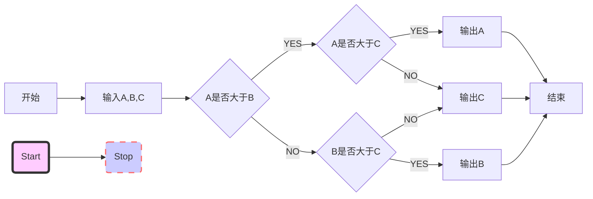

# 【志银】Markdown使用说明

---

# 1.标题

注：标准语法一般在#后跟个空格再写文字

```markdown
# 这是一级标题
## 这是二级标题
### 这是三级标题
#### 这是四级标题
##### 这是五级标题
###### 这是六级标题
```

示例：

# 这是一级标题
## 这是二级标题
### 这是三级标题
#### 这是四级标题
##### 这是五级标题
###### 这是六级标题

---

# 2.字体
```markdown
**这是加粗的文字**
*这是倾斜的文字*`
***这是斜体加粗的文字***
~~这是加删除线的文字~~
```
示例：
**这是加粗的文字**
*这是倾斜的文字*
***这是斜体加粗的文字***
~~这是加删除线的文字~~

---

# 3.引用

注：引用文字前加>即可，引用可嵌套，如加两个>>三个>>>n个...

```markdown
>这是引用的内容
>>这是引用的内容
>>
>>>>>>>>>>这是引用的内容
```

示例：

>这是引用的内容
>>这是引用的内容
>>
>>>>>>>>>>这是引用的内容

---

# 4.分割线

注：三个或者三个以上 - 或者 * 都ok

```markdown
----
***
*****
```


示例：

----
***
*****

# 5.图片

## 5.1.方法1

注：无法修改图片大小

图片alt：显示在图片下面的文字，对图片内容的解释(可加可不加，Typora无效)
图片title：图片的标题，当鼠标移到图片上时显示的内容(可加可不加，Typora无效)

```markdown

```

示例：


## 5.2.方法2

注：直接用html标签，可修改图片大小

```html

```


---

# 6.超链接

### 6.1.方法1

注：title可加可不加

```markdown
[超链接名](超链接地址 "超链接title")
```

示例：
[简书](http://jianshu.com)
[百度](http://baidu.com)

### 6.2.方法2

注：Markdown语法不支持链接在新页面中打开，简书做了处理可以。别的平台可能不行，想在新页面中打开可用html语言的a标签代替。

```html
<a href="超链接地址" target="_blank">超链接名</a>
```

示例：
<a href="https://www.jianshu.com/u/1f5ac0cf6a8b" target="_blank">简书</a>

---

# 7.列表
### 7.1.无需列表

注： - + * 任何一种都可以(- + * 与内容之间要加一个空格)

```markdown
- 列表内容
+ 列表内容
* 列表内容
```

- 列表内容
+ 列表内容
* 列表内容

### 7.2.有序列表

注：序号与内容之间要加一个空格

```markdown
1. 列表内容
2. 列表内容
3. 列表内容
```


1. 列表内容
2. 列表内容
3. 列表内容

### 7.3.列表嵌套

注：上一级和下一级之间敲三个空格即可

#### 7.3.1.玩法1

```markdown
- 列表内容
   - 列表内容
        - 列表内容
        - 列表内容
   - 列表内容
   + 列表内容
* 列表内容
```

- 列表内容
   - 列表内容
        - 列表内容
        - 列表内容
   - 列表内容
   + 列表内容
* 列表内容

#### 7.3.2.玩法2
```markdown
1. 列表内容
   1.1. 列表内容
        1.1.1. 列表内容
        1.1.2. 列表内容
   1.2. 列表内容
   1.3. 列表内容
2. 列表内容
```

1. 列表内容
   1.1. 列表内容
   ​     1.1.1. 列表内容
   ​     1.1.2. 列表内容
   1.2. 列表内容
   1.3. 列表内容
2. 列表内容

---

# 8.表格

注：

第二行分割表头和内容(`-`有一个就行，为了对齐，多加了几个)

文字默认居左

表头分割符`-`两边加：文字居中

表头分割符`-`右边加：文字居右

表头分割符`-`左边加：文字居左

(PS：原生的语法两边都要用 `| `包起来，此处省略)

```markdown
表头|表头|表头
---|:--:|--:
内容|内容|内容
内容|内容|内容
```


表头|表头|表头
---|:--:|--:
内容|内容|内容
内容|内容|内容

---

# 9.代码

### 9.1.单行代码

注：代码之间分别用一个反引号包起来

```markdown
`代码内容`
```

​    `代码内容`

### 9.2.代码块

注：代码之间分别用三个反引号包起来，且两边的反引号单独占一行

```markdown
​```
代码块...
代码块...
代码块...
​```
```

```c++
/*
二进制字符串转十进制
头文件:
	#include<iostream>
	using namespace std;
参数:
	string s: 待转化二进制字符串
返回值:
	long long : 转换后的十进制数
例子:
	cout << BinaryToInt("000010101"); //21
*/
long long BinaryToInt(string s) {
	long long sum = 0;
	int k = 0;
	for(int i = s.size()-1; i >= 0; i--) {
		long long q = 1;
		for(int j = 1; j <= k; j++) {
			q *= 2;
		}
		sum += (s[i]-48)*q;
		k++;
	}
	return sum;
}
```

---

# 10.流程图

### 10.1.mermaid代码块

注：mermaid代码块，语法如下

```markdown
​```mermaid
graph LR
start[开始] --> input[输入A,B,C]
input --> conditionA{A是否大于B}
conditionA -- YES --> conditionC{A是否大于C}
conditionA -- NO --> conditionB{B是否大于C}
conditionC -- YES --> printA[输出A]
conditionC -- NO --> printC[输出C]
conditionB -- YES --> printB[输出B]
conditionB -- NO --> printC[输出C]
printA --> stop[结束]
printC --> stop
printB --> stop

id1(Start)-->id2(Stop)
style id1 fill:#f9f,stroke:#333,stroke-width:4px,fill-opacity:0.5
style id2 fill:#ccf,stroke:#f66,stroke-width:2px,stroke-dasharray: 10,5
​```
```



### 10.2.flow代码块

注：flow代码块，语法如下

```markdown
​```flow
st=>start: 开始
op=>operation: My Operation
cond=>condition: Yes or No?
e=>end
st->op->cond
cond(yes)->e
cond(no)->op
​```
```

```flow
st=>start: 开始
op=>operation: My Operation
cond=>condition: Yes or No?
e=>end
st->op->cond
cond(yes)->e
cond(no)->op
```

---

# 11.待更新...

