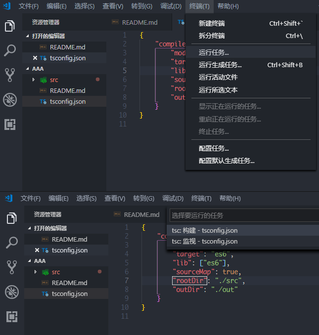

# 编译TypeScript(TypeScript转JavaScript)

# 1.配置tsconfig.json文件

`tsconfig.json`文件配置说明

```json
{
	"compilerOptions": {  //生成相关说明,TypeScript编译器如何编译.ts文件。
		"module": "commonjs",  //指定模块代码生成:“none”、“commonjs”、“amd”、“system”、“umd”、“es2015”或“esnext”。
		"target": "es6",  //指定ECMAScript目标版本。许可值为“es3”、“es5”、“es6”、“es2015”、“es2016”、“es2017”、“es2018”或“esnext”。
		"lib": ["es6"],  //指定要包含在编译中的库文件。需要TypeScript 2.0或更高版本。
		"sourceMap": true,  //是否生成相应的“地图”的文件。
		"rootDir": "src",  //指定输入文件的根目录。使用——outDir控制输出目录结构。
		"outDir": "out"  //将输出结构重定向到目录。
	}
}
```

# 2.编译命令

```cpp
npm install -g typescript  //全局安装typescript
tsc  //编译(一次性编译)
tsc -watch  //编译并监视(每次保存待编译文件都会自动更新编译文件)
```

# 3.vscode编译



